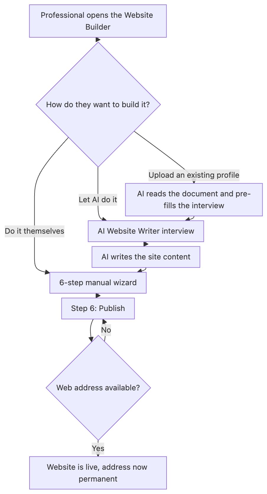
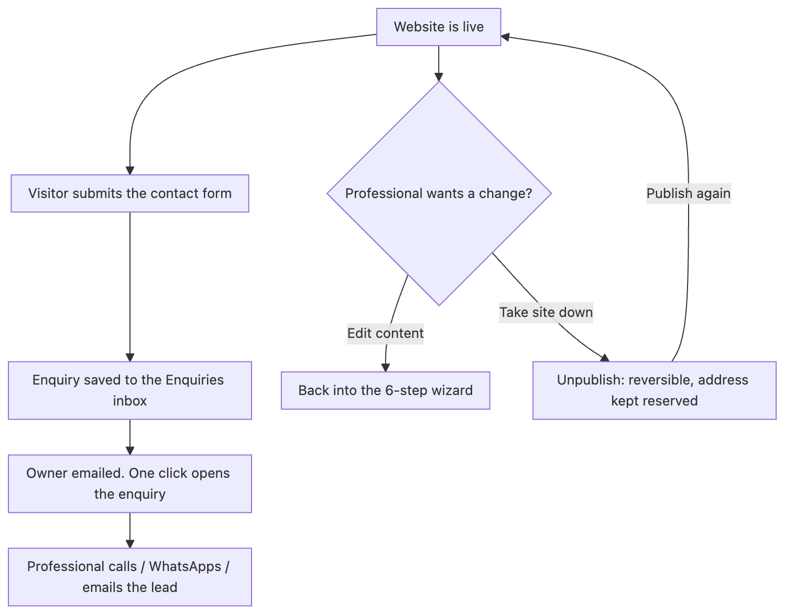

# Personalised Website Builder
## Business Requirements Document

| | |
|---|---|
| **Product** | Personalised Website Builder, a module of Spectrum Cloud Office Management |
| **Product owner** | KDK Software |
| **Prepared by** | Kartik Khandelwal |
| **Version** | 1.0 |
| **Date** | 17 August 2026 |
| **Audience** | Development team, QA, design, product, leadership |
| **Status** | Issued to development |

> This document describes what will be built, screen by screen, in enough detail that development, QA, design and leadership can all work from it without a separate conversation. Screenshots show how a screen should look; where a screenshot and a written rule disagree, the written rule is correct.
>
> Sign-in, accounts, profile and billing will be handled by Spectrum Cloud Office Management. They are not part of this module and are not described here.

## Table of Contents

1. [Objective](#1-objective)
2. [Entry Point and Plans](#2-entry-point-and-plans)
3. [Executive Summary](#3-executive-summary)
4. [Background](#4-background)
5. [Product Scope](#5-product-scope)
6. [The Complete User Journey](#6-the-complete-user-journey)
7. [Functional Requirements and Validation Rules](#7-functional-requirements-and-validation-rules)
8. [Domain Names](#8-domain-names)
9. [Website Templates and Design System](#9-website-templates-and-design-system)
10. [Non-Functional Requirements](#10-non-functional-requirements)
11. [Getting Published Sites Found on Google](#11-getting-published-sites-found-on-google)

## 1. Objective

To give our users (Chartered Accountants, Company Secretaries, Tax Practitioners and Advocates) a digital presence without needing any technical knowledge, in 2 to 5 minutes.

This document is the single source of truth for how that objective will be built: what the product will do, how each screen will behave, and what the user will see, screen by screen, so development, QA, design and leadership can all work from this one document.

## 2. Entry Point and Plans

### 2.1 Entry Point

This will not be a separate product. It will live inside the existing Spectrum Cloud Office Management, as a new tab named **Website Builder**, and that tab will be the entry point into everything described in this document.

Because it lives inside Spectrum Cloud, the login will be the same Spectrum Cloud login. There will be no separate sign-up, password, or account for this module.

### 2.2 The Account Menu

An account card will sit in the bottom-left corner of the builder, showing the professional's name, email, and initials. Clicking it will open a menu with five items:

| Menu item | What it will do |
|---|---|
| Profile | Reserved for later. Not part of this module |
| Enquiries | Opens the Enquiries inbox described in [Section 6.6](#66-managing-enquiries) |
| Settings | Reserved for later. Not part of this module |
| Subscription | Reserved for later. Not part of this module |
| Sign Out | Ends the session and returns to the Spectrum Cloud sign-in screen |

Only **Enquiries** and **Sign Out** will do anything at launch. Profile, Settings, and Subscription will be visible slots reserved for account details, notification preferences, and whatever commercial plan features get decided later, respectively. None of the three is built as part of this module, and building them is a Spectrum Cloud decision, not one for this document.

**Sign Out will also clear anything saved only on this device**, such as an in-progress draft or unsaved AI Writer answers, so the next person to sign in on the same device never sees a previous user's unsaved work.

### 2.3 Plans

**Not yet finalised.** Whether this module will be available on every Spectrum Cloud plan, held back as a paid add-on, or offered as a trial ahead of a paid tier, is a business decision that has not been made yet. This section will be completed once that decision is confirmed; everything else in this document does not depend on it.

## 3. Executive Summary

Most Chartered Accountants, Advocates, Tax Consultants, GST Practitioners, Company Secretaries and Cost Accountants in India do not have a website. Getting one built the traditional way is expensive, slow, and requires technical knowledge they don't have and don't want to learn.

The Personalised Website Builder will solve this by letting any of these professionals create a complete, professional, mobile-friendly website in under 10 minutes, either by:

1. Answering simple questions themselves, in a guided 6-step wizard, or
2. Letting an AI writer do it for them: a short interview where they describe their practice in their own words, and the AI writes all the website copy.

Once published, the website will go live immediately at its own web address, collect enquiries from visitors into a built-in inbox, and can be edited or taken offline at any time. No developer, no waiting, no separate invoice.

## 4. Background

### 4.1 The Problem

Talk to any small or mid-sized CA firm, law office, or tax practice in India, and the story is the same:

- A website costs ₹15,000 to ₹80,000 through a freelancer or agency.
- It takes 4 to 8 weeks to get anything live.
- They don't have anyone in-house who can build or update it.
- Once it's live, even a simple change (a new phone number, a new service) means going back to whoever built it, and often paying again.

The result: the overwhelming majority of these professionals either have no website at all, or a hopelessly outdated one, at exactly the time when a prospective client's first move is to search for them online.

### 4.2 Goals

- Let a non-technical user go from nothing to a published, professional website in under 10 minutes. The value collapses if it needs a developer or takes hours.
- Make every published site look genuinely professional, never generic or "templated". A cheap-looking website damages credibility for a CA or Advocate more than having none.
- Capture enquiries directly from the website, in one place the professional already checks. The website must generate business, not just exist as a brochure.
- Never let a real, published website show placeholder or sample content. A firm's website carrying someone else's demo address, quotes, or numbers is a trust-breaking failure, not a cosmetic bug.
- Increase how much value each existing KDK customer represents. This is a new product line inside an existing relationship, not a new customer to acquire.
- Keep the product usable and distinct-looking at scale (hundreds or thousands of live sites). A template-based builder risks every site looking the same once there are many of them.

### 4.3 Who This Is For

The builder will serve six professions. Each will get a starter set of services pre-loaded so the user isn't starting from a blank page:

| Profession | Pre-loaded services |
|---|---|
| Chartered Accountant | Income Tax Return filing, GST, Tax Audit, TDS, ROC filings, NRI services |
| Advocate / Lawyer | Civil, Criminal, Corporate, Tax litigation, Property matters |
| Tax Consultant | ITR filing, TDS, Tax planning, NRI tax, IT notices |
| GST Practitioner | GST registration, Returns filing, GSTR-9, Notice handling |
| Company Secretary | Company incorporation, ROC filings, FEMA compliance, Board meetings |
| Cost Accountant | Cost audit, CAS compliance, Management accounting, Budgeting |

A typical user will run a small-to-mid-sized practice, be comfortable with WhatsApp and basic apps, but will never have built a website and will not want to learn HTML, hosting, or design software.

There will also be a second, indirect user of this product: the visitor to a published site (a prospective client of the professional). Their needs matter too: the site must load fast, read clearly on a phone, and make it obvious how to make contact.

## 5. Product Scope

### 5.1 In Scope

- A guided, 6-step wizard covering design, business details, content, services, and publishing.
- An AI Website Writer that will be able to fill out the entire site from a short conversational interview.
- A login system, so a professional's site and drafts are saved to their account. (Handled by Spectrum Cloud.)
- Four website designs, each with six colour options, so no two firms need to look identical.
- A built-in enquiries inbox: every message a visitor sends will be saved, searchable, exportable, and trackable by status.
- Hosting and a live web address the moment the user clicks Publish, with the ability to take a site offline (and bring it back online) at any time.
- A WhatsApp chat button on every published site.
- Mobile-responsive design and automatic SSL (the padlock/https that browsers require).
- Automatic groundwork for the site to be found on Google.
- Import from a profile document: the professional uploads a firm profile they already have, and the AI fills in whatever it covers.

### 5.2 Out of Scope

- Custom domains (a firm's own `.com`, rather than a KDK-provided address).
- A client-facing portal or login on the published website.
- A blog or multi-page sites: every published site will be a single page.
- Payment collection or an appointment-booking system on the site.
- Automatic import of a professional's existing Spectrum Cloud data into the website. This is **not** the same as the profile upload in [Section 6.5](#65-import-from-a-profile-document), which reads a document the user hands over themselves, and never reaches into KDK's own customer records.

## 6. The Complete User Journey

### 6.1 User Flow

The journey has two halves. The first happens once, in a few minutes. The second repeats for as long as the site is live.

**Getting the website built and live**

{width=60%}

**What happens once it is live**



### 6.2 Two Ways to Build: Do It Yourself, or Let the AI Do It

Every user will be able to either:

- Work through the 6-step wizard below at their own pace, filling in each screen, **or**
- Open the AI Website Writer (a floating button, always available) and have the AI write the entire site's content, which will then drop straight into the same six steps for review.

Both paths will lead to the exact same place: a finished configuration ready for Step 6 (Publish). Most users are expected to prefer the AI path; the manual steps will stay available for anyone who wants full control, or wants to fine-tune what the AI produced.

Opening the AI Website Writer will itself offer two ways to start it, not one:

- **Start writing my website**: answer a short set of questions directly, described in [Section 6.4](#64-the-ai-website-writer).
- **I already have a firm profile**: upload a brochure, CV or capability statement the firm already has, so the AI can read it and pre-fill as many answers as it can before asking only what is left over, described in [Section 6.5](#65-import-from-a-profile-document).

Both of these starting points will feed into the exact same interview and the exact same six steps. Uploading a document will never skip a required question. It will only reduce how much the professional has to type by hand.

### 6.3 The 6-Step Wizard

| Step | Name | What the user will do |
|---|---|---|
| 1 | Design & Colours | Pick one of 4 website designs, then one of 6 colour options for that design |
| 2 | Business & Contact | Firm name, profession (loads the right starter services), phone, email, office address, office hours, social links |
| 3 | Hero & Stats | The main banner text visitors see first, plus up to 6 key numbers |
| 4 | Services | Turn the pre-loaded services for their profession on or off, edit any description, or add their own |
| 5 | About & Story | Firm story, founder/partner photos and roles, how the firm works, and client reviews |
| 6 | Publish | Pick a web address and go live |

The wizard will allow movement between steps in any order using a left-hand navigator, and will not force a strict front-to-back path, but every required field will still be checked before the site can actually be published. That same navigator will also carry a permanent **Import from a profile** entry, described in [Section 6.5](#65-import-from-a-profile-document), so it stays reachable throughout, not only at the very start.

#### Step 1: Design & Colours

Nothing here will ever be left unset. Every account will start on a default design and colour option, so this step is about changing that default, not filling in a blank. Each design will carry its own set of six curated colour options, so the same layout can look completely different from one firm's site to the next. Switching either the design or the colour will be instant and will keep every other answer the user has already given; only the look will change.


#### Step 2: Business & Contact

The firm's identity and how clients reach them. This step will be split into four sections:

- **Firm Identity**: profession, firm/practice name, tagline, founded year, team size, city, and an optional firm logo.
- **Contact Information**: phone number, WhatsApp number, email, office hours, office address, and optional membership/registration numbers.
- **Social Media Links**: LinkedIn, Facebook, Instagram, YouTube. Each will be optional; leaving one blank will hide its icon on the published site rather than showing a broken or dead link.
- **Footer**: a short footer blurb and the copyright line shown at the bottom of every page. "Powered by KDK Software" will be added automatically and cannot be removed.


#### Step 3: Hero & Stats

The banner text and key numbers a visitor sees first. This step will cover:

- **Hero Banner**: an eyebrow badge (e.g. "Now accepting clients for FY 2025-26"), the headline, a highlighted phrase within it, a sub-heading, primary and secondary call-to-action buttons, and audience tags (short labels shown under the hero).
- **Key Stats**: up to 6 numbers that build trust (clients served, years of practice, ratings, on-time percentage), each with a quick-insert button for common symbols. Stats should show three to six at a time, or none at all. One or two numbers looks unfinished.


#### Step 4: Services

The profession's starter services, editable and extendable. Every pre-loaded service will be switchable on or off, and its name and description will be freely editable. A text box at the bottom will let the user add entirely custom services beyond the starter list, for a firm that offers something not in the standard set.


#### Step 5: About & Story

The firm's story, partners, process, and reviews. This will be the largest step, split into five sections:

- **About Your Firm**: a short introduction (45 to 70 words) shown in the About section.
- **Founders & Partners**: up to 4 partners, each with a name, role/designation, an optional portrait, and a short bio with credentials.
- **About Highlights**: exactly 3 short selling points shown alongside the About section, each with a one-line explanation.
- **How We Work**: 3 to 5 numbered steps describing the client journey.
- **Client Testimonials**: optional; if used, 3 to 6 reviews, each with a star rating, quote, client name, role/company, and an optional photo.


#### Step 6: Publish

The live preview, the web address, and every control for managing a live site. What this screen shows should depend entirely on where the site currently stands. There should be four distinct states:

**1. Never published yet.** There will be no live site to show. Only a preview of what will go live, a checklist confirming what is included, and a single **Launch Website** button (shown inactive until the typed address is confirmed available). Once nothing is left to complete, the screen should give its last useful warning: *"Check your address before you launch. It cannot be changed afterwards, so that every link you share keeps working."* Until then, that same space should be used to name whatever is still missing.


**2. Live, with changes not yet published.** After the first publish, any further edit anywhere in the builder should put the site into this state: the live preview will still show what visitors currently see, but a banner will make clear that newer changes are waiting, naming the date of the version actually out there. The buttons will be **Publish changes** and **Unpublish**.


**3. Live, and fully up to date.** Once "Publish changes" is pressed (or nothing has been edited since the last publish), the hint should confirm the site matches what's live, and there is nothing to publish: **Unpublish** will be the only button left.


**4. Taken offline (unpublished).** After pressing Unpublish, the preview should dim and be stamped "NOT PUBLISHED," and the only action should be **Publish again**. The address itself will never be released, so nobody else can claim it while the site sits offline: *"Your site is offline. Your address stays reserved for you."*


##### The Address Will Be Permanent Once the Site Is Live

The address should be chosen once, before the site is launched, and the field should be read-only from that moment on. There will be no way for the professional to rename a live site, and no way to move it to a different domain.

- A changed address would break every link already shared: visiting cards, WhatsApp forwards, client emails, letterhead.
- Google would have to find and re-rank the new address from scratch, undoing the site's search standing.
- The old address would become free for someone else to claim, so a competitor could end up sitting on the address a firm printed on its stationery.

A professional who launches with a typo in their address will have to live with it: there will be no correction path for the user, and no admin screen for KDK support either. There will also be no Delete anywhere in the product, so a site cannot be removed and re-created at a better address. Unpublish will keep the address reserved and be the only way down.

#### Open Question: How Many Times May a Site Be Published?

There should be no limit anywhere in the product on how many times a professional can publish or re-publish their site, unless a future business decision introduces one for abuse prevention or cost control.

### 6.4 The AI Website Writer

This should be a short, conversational interview (7 screens plus a final review) that stands in for typing everything out by hand.


**What it will ask, screen by screen:**

1. **Your practice**: profession, firm name, years practising
2. **What sets you apart**: what you're best known for, your typical clients, and (optionally) key numbers to show off
3. **How you work**: a step-by-step description of your process
4. **Founders & partners**: name, role, what each partner handles, and a photo
5. **Client reviews**: optional testimonials
6. **Contact details**: city, phone, email, office address, office hours, social links
7. **Anything else**: a free-text box for anything not already covered (awards, languages, specialisations)
8. **Review & write**: a final summary before the AI generates the site


#### What Makes It Easier for a Returning User

If the firm already has a published site, opening the AI Writer should automatically fill in every plain fact it already knows: firm name, city, years in practice, phone, email, address, office hours, social links, and every partner's name, role, and photo, shown highlighted in green, with a note explaining where each came from. Only the more subjective, judgement-based answers (what you're known for, your typical clients, your review notes) should be left blank, because the site only stores the AI's polished write-up of those answers, not the user's original rough notes, and feeding the polished text back in as a "question" would just produce blander answers on a second pass.


#### Why Partners Should Be Asked What They Handle

A name and a designation alone give the AI nothing to write from, and it would fill that gap by inventing plausible-sounding history for a real, named person. The box should be optional, but whatever is typed into it will be the only material the partner's write-up may be built from. Left empty, the AI must write a short factual line naming the person's role and nothing more.

### 6.5 Import From a Profile Document

This is the second way of starting the AI Website Writer, described in [Section 6.2](#62-two-ways-to-build-do-it-yourself-or-let-the-ai-do-it). It is not a separate product. It feeds the same interview and the same six steps as [Section 6.4](#64-the-ai-website-writer), but it deserves its own explanation, because what it is and is not allowed to do is one of the most important rules in this document.

Most established firms already have a profile document: a firm brochure, a partner's CV, a capability statement sent to clients. Retyping it into the interview is work the professional has already done once, so the AI Writer's opening screen should offer this as one of its two starting choices, carrying equal visual weight to "answer questions directly", since plenty of sole practitioners have no such document, and that path must not read as the lesser one.


Accepted formats will be PDF, Word documents, and photographs of a printed profile, up to 10 MB. Once the document has been read, the interview should open with whatever it states already filled in and tinted green, under a banner naming the uploaded document as the source. Whatever the document did not cover will still be asked for, screen by screen, exactly as if the user had started from scratch.

#### Always Reachable, Not Just at the Start

The opening choice is not the only way in. A permanent **Import from a profile** entry will sit in the builder's left-hand drawer at all times, so a professional who skipped it at the start, or who only finds their document later, can still bring it in without losing anything they have already typed.

An import done this way, part-way through the interview, will only fill in answers that are still blank. It must never overwrite anything the professional has already typed by hand, even if the document states something different for that field.

#### The Rule This Feature Is Built Around

**A field the document does not state must come back empty. It must never be guessed.** If the AI invents a plausible "best known for" or an impressive client count, the professional would publish a claim they never made and were never asked about. These users are ICAI and Bar Council registered and work under advertising and misrepresentation rules, so a fabricated credential on their website would be their liability, written by our product.

A worked example, because this behaviour will read as a bug until it is explained: one firm's profile states "more than 50 years in aggregate experience," meaning the total across its six partners. The correct result should be to leave "Years practising" empty, and keep the 50 only as a key number with its qualifier intact. Filling in 50 would publish "50 years of practice" for a firm that may be ten years old.

| Taken from the document | Never taken from the document |
|---|---|
| Firm name, city, phone, email, office address, office hours | Client reviews, so skipping that screen leaves testimonials already live untouched |
| Years practising, but only where stated or derivable from a founding year | Any figure for the stats strip that is not a genuine client-facing trust signal |
| Partner names, and a designation only where the document states a job title | A partner's role inferred from a qualification |
| Which of the builder's own services to switch on, matched on meaning | New services outside the builder's preset list |
| Social links, and claims the document explicitly makes | Anything the document merely implies |

#### Privacy

The uploaded document will not be kept. It will be read once, and discarded. It will not be saved to the professional's account, not stored on KDK's servers, and not retained in any form afterwards. Only the extracted answers will reach the user's own draft, and only after they have seen them on screen.

#### Cost to KDK

Reading a profile should cost roughly ₹0.35 per website, once, and should not scale with file size or recur per visitor.

### 6.6 Managing Enquiries

Every website will have a contact form. When a visitor submits it, the enquiry should be saved instantly into a built-in **Enquiries inbox** inside the builder. The professional will not need any other tool to see it.


From that inbox the professional should be able to:

- Search and filter enquiries by status (new, in progress, done, etc.)
- Add private notes to any enquiry
- Call, WhatsApp, or email the visitor directly from the same screen
- Export enquiries to a spreadsheet, either individually selected or all at once

#### Being Told an Enquiry Has Arrived

An inbox nobody is told about is a missed client, so every enquiry should be emailed to the professional the moment it is submitted, with one click in that email opening that enquiry. The enquiry must be saved first, and the email sent afterwards. An email that fails, for any reason, must never be able to cost the professional the enquiry itself. The alert should be sent from a properly configured KDK address through a transactional email service, not from the professional's own address, so it actually reaches the inbox rather than a spam folder.

**Subject:** New enquiry from *[visitor's name]* for *[firm name]*

**Preview line**, so the essentials are readable on a phone without opening the mail: *phone number · what they are interested in · when it arrived*

```
  [ KDK Sites logo ]

  You have a new enquiry

  Someone filled in the contact form on your website
  [ the firm's web address ].

  Name           [ visitor's name ]
  Phone          [ visitor's phone ]        tap to call
  Email          [ visitor's email ]        row hidden if not given
  Interested in  [ service selected ]       row hidden if not given
  Received       [ date and time, IST ]

  Their message
  [ the message ]                           block hidden if not given

       [  View this enquiry  ]

       [ Call ]     [ WhatsApp ]

  You are receiving this because this enquiry came through your
  website on KDK Sites.
```

Both the firm name and the web address should appear because one account may eventually own more than one site, and the owner has to be able to tell at a glance which of them the enquiry came from.

Three rules the email must follow:

1. **A blank field prints nothing at all.** Only a name and a phone number will be compulsory on the contact form, so the email address, the chosen service, and the message may each be missing. Any missing row must disappear from the email entirely. It must never be filled with a placeholder or an example.
2. **Replying must reach the client.** When the visitor gave an email address, pressing Reply must write to them, not to an unattended KDK mailbox.
3. **It must read correctly as plain text as well as with formatting**, since many corporate mail systems strip or distrust formatted mail.

##### The Click Through

"View this enquiry" must open that specific enquiry, not merely the inbox. It must be found and shown wherever it sits in the list, however old it is, with its full message already open.

##### Junk Protection

The moment alerts are switched on, automated junk submitted to the contact form would go straight to the professional's mailbox, and the resulting spam complaints would damage the reputation of the single KDK address every client's alerts are sent from. Basic protection must therefore be part of this feature, not a follow-up to it: a hidden field that only automated submissions fill in, and a ceiling on how many alerts one site may send in an hour, with a single summary email once that ceiling is reached.

## 7. Functional Requirements and Validation Rules

This section lists exactly what will be required on every screen, and the rule the product will enforce for each field. Anything not listed as required will be optional.

### 7.1 Step 1: Design & Colours

| Field | Required? | Validation rule |
|---|---|---|
| Website design | Always set | Every account will start on a default design with its first colour option already applied, so nothing blocks progress here |
| Colour option | Always set | A colour from the chosen design's set of six will always be active by default |

### 7.2 Step 2: Business & Contact

| Field | Required? | Validation rule |
|---|---|---|
| Profession | Yes | Must be selected from the list of 6 supported professions |
| Firm / practice name | Yes | Cannot be left blank |
| City | Yes | Cannot be left blank |
| Phone number | Yes | Cannot be left blank |
| Email address | Yes | Cannot be blank, and must be in a valid email format |
| Office address | Yes | Cannot be left blank, and can never be filled in by the AI |
| Office hours | Yes | Cannot be left blank; will be pre-filled with a common default |
| Firm logo / any photo upload | No | Image file only (PNG, JPG, SVG, WebP, or GIF), no larger than 2 MB for a logo, 5 MB for any other photo |

### 7.3 Step 3: Hero & Stats

| Field | Required? | Validation rule |
|---|---|---|
| Hero headline | Yes | Cannot be left blank |
| Key stats | No | If none are added, the section will be left out entirely. If any are added, at least 3 will be required (up to a maximum of 6) |

### 7.4 Step 4: Services

| Field | Required? | Validation rule |
|---|---|---|
| Services shown on the site | At least 1 | At least one service must be switched on before the user can continue |

### 7.5 Step 5: About & Story

| Field | Required? | Validation rule |
|---|---|---|
| Founders / partners | At least 1 | At least one partner must have both a name and a role |
| Partner / reviewer photo | No | Same image-file rule as above; every accepted photo will be cropped to a square before it's stored |
| Firm story, process steps, client reviews | No | All optional; any section left empty will be hidden from the published site rather than showing placeholder content |

### 7.6 Step 6: Publish

| Field | Required? | Validation rule |
|---|---|---|
| Web address (subdomain) | Yes | Cannot be blank, at least 3 characters, lowercase letters/numbers/hyphens only, and must pass a live availability check |
| Changing the address after launch | Not permitted | Once published even once, the address will be fixed and the field read-only, with no user or admin override |
| Deleting a site | Not offered | There will be no delete anywhere in the product; Unpublish will be the only way down |

### 7.7 AI Website Writer, Screen 1: Your Practice

| Field | Required? | Validation rule |
|---|---|---|
| Profession | Yes | Must be selected |
| Firm / practice name | Yes | Cannot be left blank |
| Years practising | Yes | Cannot be left blank; anchors the firm's Founded Year and any AI-written stats |

### 7.8 AI Website Writer, Screen 2: What Sets You Apart

| Field | Required? | Validation rule |
|---|---|---|
| What you're best known for | Yes | At least 2 entries required |
| Your typical clients | Yes | At least 2 entries required |
| Key numbers worth showing | No | If any are added, at least 3 must be added (up to 6). The AI will never invent a number the user did not provide |

### 7.9 AI Website Writer, Screen 3: How You Work

| Field | Required? | Validation rule |
|---|---|---|
| Process steps | Yes | At least 3 steps required (maximum 5) |

### 7.10 AI Website Writer, Screen 4: Founders & Partners

| Field | Required? | Validation rule |
|---|---|---|
| At least one partner | Yes | At least 1 partner row required (maximum 4) |
| Name and role, per row started | Yes | Both required together before the interview can continue |
| What do they handle? | No | The only source the AI is allowed to build a partner's write-up from |

### 7.11 AI Website Writer, Screen 5: Client Reviews

| Field | Required? | Validation rule |
|---|---|---|
| Reviews | No | Entirely optional; but if the user adds any review, at least 3 are required (maximum 6) |
| Name and note, per row started | Yes | Both required together |

### 7.12 AI Website Writer, Screen 6: Contact Details

| Field | Required? | Validation rule |
|---|---|---|
| City, phone, email, office address, office hours | Yes | Cannot be left blank; the office address can never be invented by the AI |
| Social media links | No | Each one supplied becomes an icon in the site's footer |

### 7.13 Import From a Profile Document

| Field | Required? | Validation rule |
|---|---|---|
| The uploaded file | No | Must be a PDF, a Word document, or an image, no larger than 10 MB |
| Every answer the document does not state | Must be left empty | No inference, no estimate, no reasonable guess |
| The uploaded file afterwards | Must not be retained | Read once and discarded |

### 7.14 Email Alert When an Enquiry Arrives

| Requirement | Rule |
|---|---|
| When it is sent | On every enquiry, as soon as it is submitted |
| Order of events | The enquiry must be stored first, the email sent afterwards |
| Missing details | Any field the visitor left blank must be removed from the email entirely |
| Automated junk | The contact form must reject automated submissions silently, and no site may send more than a set number of alerts in an hour |

### 7.15 The Rule Behind All of This: No Placeholder Content on a Live Site

Across every screen above, the product must follow one consistent principle: **if a field is genuinely optional and the user leaves it empty, that section of the website will disappear. It must never fall back to showing the template's own sample text.** A firm that adds no client reviews should get no testimonials section at all, rather than the design's built-in sample quotes. This must be treated as a hard product rule: any new field added to the builder in future must have a clear, deliberate answer to "what does the published site show if this is left blank?"

## 8. Domain Names

Every published site will need a web address in the form `<firm-name>.<domain>`. KDK will build a small pool of its own domain names so a professional can pick the one that best suits their profession, rather than every site sharing a single generic address.

| Domain | Positioning | Status |
|---|---|---|
| `kdksites.in` | The general, all-profession KDK Sites address | Live |
| `CAworld.in` | Chartered Accountants | Name finalised, not yet purchased |
| `Mycafirm.in` | Chartered accountancy firms | Name finalised, not yet purchased |
| `caone.ai` | Modern, tech-forward practices | Name finalised, not yet purchased |
| `cadesk.app` | A clean, app-style address | Name finalised, not yet purchased |

Once a domain in this list is purchased and connected, it should become selectable from the same address picker in Step 6 (Publish). No other change should be needed anywhere else in the product.

Certain subdomains must never be issued, because they would collide with routing, mail, or the platform itself: `www`, `api`, `app`, `admin`, `mail`, `blog`, `support`, `login`, `kdk`, `kdksites`, `site`, `sitemap`, and similar reserved words.

## 9. Website Templates and Design System

### 9.1 The Four Designs

| Design | Best for |
|---|---|
| Apex | Chartered Accountants, Tax & Financial Consultants (marked "Most Popular") |
| Heritage | Advocates & Legal Consultants |
| Nova | Tax Consultants, GST Practitioners |
| Zenith | Company Secretaries, Corporate professionals |

Each design should offer six curated colour options of its own (24 combinations in total), each checked to make sure colours are genuinely distinguishable from one another and that text stays easily readable against its background.


*Apex*


*Heritage*


*Nova*


*Zenith*

### 9.2 What Every Published Site Will Include

Regardless of which design is chosen, every published site should have the same set of sections, populated with that firm's own content:

1. Navigation bar: firm name/logo and menu, becomes solid on scroll
2. Hero banner: firm name, tagline, calls to action
3. Key numbers: up to 6 stats, if the user chose to add them
4. Services: the profession's services, as toggled/edited by the user
5. About: firm story and credentials
6. Founders/Partners: photo, name, role for each
7. How We Work: a numbered process, at least 3 steps
8. Client Reviews: testimonials, if the user chose to add them
9. Contact: details, an enquiry form, and a floating WhatsApp button
10. Footer: firm details and "Powered by KDK Software"

### 9.3 Design Principles

- No emoji anywhere: icons should be hand-drawn, geometric line icons.
- No Google Fonts or other external assets: the device's own system font, so pages load instantly.
- Every design must be fully responsive on mobile, where the large majority of a professional's clients will view it.
- Every published site must be automatically secured (https/SSL): visitors should never see a "not secure" warning.

## 10. Non-Functional Requirements

| Requirement | What it means in practice |
|---|---|
| Speed | Pages should feel instant. No large downloads, no waiting on external fonts or scripts. |
| Mobile-first | Every screen, in the builder and on published sites, must work cleanly on a phone, not just a desktop. |
| Security | Every published site must be served over https automatically. AI credentials must never be exposed to a visitor's browser. |
| Account privacy | A professional's draft and published site must be tied to their login; nobody else can see or edit them. |
| Reversibility | Taking a site offline should always ask for confirmation first, and should always be recoverable. There must be no way to permanently delete a site. |
| No broken defaults | A skipped field must never show someone else's placeholder text on a real, live website. |
| Availability | Once published, a site should stay reachable continuously; taking it down is something only its owner does deliberately. |
| Uploaded documents are not kept | A profile document uploaded for import must be read once and discarded, never stored against the account. |
| Enquiries survive everything | An enquiry must be stored the moment it is submitted, before any notification is attempted, so no failure elsewhere can lose one. |
| Alerts must actually arrive | Enquiry alerts are transactional email and must reach the inbox rather than the spam folder. |

## 11. Getting Published Sites Found on Google

Every published site should automatically get the technical groundwork search engines look for: an accurate page title and description drawn from the firm's real details (not template placeholder text), a clean preview image and link summary for when the site is shared on WhatsApp, and a structured, machine-readable summary of the business (name, phone, address, hours, services) that can help a Google search result show more than just a plain blue link. None of this should require the professional to do anything extra. It should be generated automatically from whatever they typed into the builder, and should update itself the next time they publish a change.

Two things are known limitations rather than something to quickly fix:

- A KDK-provided address (`name.kdksites.in`) will generally rank a little behind a firm's own domain name. This is true of every website builder, not unique to this product.
- Since every site uses one of only four templates, at large scale (thousands of live sites) Google may recognise the shared structure across firms, which could affect ranking. This is a byproduct of how any template-based builder works.

*End of document.*
