# Personalised Website Builder
## Product Requirements Document (PRD)

| | |
|---|---|
| **Product** | KDK Sites: Personalised Website Builder |
| **Product owner** | KDK Software (appadmin@kdksoftware.com) |
| **Maintainer** | Kartik Khandelwal (Kartik.khandelwal@kdksoftware.com) |
| **Status** | Phase 1: working prototype, live and in active development |
| **Audience** | Everyone: leadership, product, design, developers, support, sales |
| **Last updated** | 17 August 2026 |

> **How to read this document:** It is written in plain language on purpose, so anyone at KDK can pick it up and understand what the product is, why it exists, who it's for, and exactly what it does today, not just the engineers building it. Every screen described below is shown with a real screenshot taken directly from the working product, not a mockup. Where a rule needs to be exact (for example, a validation rule a developer must build to), it is spelled out in full rather than summarised.
>
> **What this document does not carry:** delivery status. Which parts are already running, which are in build, and which are still to start is tracked separately in the team's working notes, so this document stays a stable description of the product rather than something that has to be restructured after every release.

## 1. Purpose of This Document

This document is the single source of truth for the Personalised Website Builder. It sets out **what the product does, how each screen behaves, and what the user sees**, screen by screen, along with the reasoning behind each decision, in enough detail that leadership, design, development, support, and sales can all work from this one document without a separate conversation.

## 2. Executive Summary

Most Chartered Accountants, Advocates, Tax Consultants, GST Practitioners, Company Secretaries, and Cost Accountants in India do not have a website. Getting one built the traditional way is expensive, slow, and requires technical knowledge they don't have and don't want to learn.

The Personalised Website Builder solves this by letting any of these professionals create a complete, professional, mobile-friendly website in under 10 minutes, either by:

1. **Answering simple questions themselves** in a guided, 6-step wizard, or
2. **Letting an AI writer do it for them**: a short interview where they describe their practice in their own words, and the AI writes all the website copy.

Once published, the website goes live immediately at its own web address, collects enquiries from visitors into a built-in inbox, and can be edited or taken offline at any time. No developer, no waiting, no separate invoice.

The product is a **working prototype**, live for real use. It is not yet part of KDK's official commercial offering: pricing and packaging are still to be decided.

## 3. Background

### 3.1 The Problem

Talk to any small or mid-sized CA firm, law office, or tax practice in India, and the story is the same:

- A website costs **₹15,000 to ₹80,000** through a freelancer or agency.
- It takes **4 to 8 weeks** to get anything live.
- They don't have anyone in-house who can build or update it.
- Once it's live, even a simple change (a new phone number, a new service) means going back to whoever built it, and often paying again.

The result: the overwhelming majority of these professionals either have no website at all, or a hopelessly outdated one, at exactly the time when a prospective client's first move is to search for them online.

### 3.2 Goals

- **Let a non-technical user go from nothing to a published, professional website in under 10 minutes.** The entire value proposition collapses if it needs a developer or takes hours.
- **Make every published site look genuinely professional, never generic or "templated".** A cheap-looking website damages credibility for a CA or Advocate more than having none.
- **Capture enquiries directly from the website, in one place the professional already checks.** The website must generate business, not just exist as a brochure.
- **Never let a real, published website show placeholder or sample content.** A firm's website carrying someone else's demo address, quotes, or numbers is a trust-breaking failure, not a cosmetic bug.
- **Increase how much value each existing KDK customer represents.** This is a new product line inside an existing relationship, not a new customer to acquire.
- **Keep the product usable and distinct-looking at scale** (hundreds or thousands of live sites). A template-based builder risks every site looking the same once there are many of them.

### 3.3 Who This Is For

The builder currently serves six professions. Each gets a starter set of services pre-loaded so the user isn't starting from a blank page:

| Profession | Pre-loaded services |
|---|---|
| Chartered Accountant | Income Tax Return filing, GST, Tax Audit, TDS, ROC filings, NRI services |
| Advocate / Lawyer | Civil, Criminal, Corporate law, Tax litigation, Property matters |
| Tax Consultant | ITR filing, TDS, Tax planning, NRI tax, IT notices |
| GST Practitioner | GST registration, Returns filing, GSTR-9, Notice handling |
| Company Secretary | Company incorporation, ROC filings, FEMA compliance, Board meetings |
| Cost Accountant | Cost audit, CAS compliance, Management accounting, Budgeting |

A typical user: runs a small-to-mid-sized practice, is comfortable with WhatsApp and basic apps, but has never built a website and doesn't want to learn HTML, hosting, or design software.

There is also a **second, indirect user of this product**: the visitor to a published site (a prospective client of the professional). Their needs matter too: the site must load fast, read clearly on a phone, and make it obvious how to make contact.

## 4. Product Scope

### 4.1 What's In Scope (Phase 1, current)

- A guided, 6-step wizard covering design, business details, content, services, and publishing
- An **AI Website Writer** that can fill out the entire site from a short conversational interview
- A **login system**, so a professional's site and drafts are saved to their account
- **Four website designs**, each with six colour options, so no two firms need to look identical
- A **built-in enquiries inbox**: every message a visitor sends is saved, searchable, exportable, and trackable by status
- **Hosting and a live web address** the moment the user clicks Publish, with the ability to take a site offline (and bring it back online) at any time
- A **WhatsApp chat button** on every published site
- **Mobile-responsive** design and automatic **SSL** (the padlock/https that browsers require)
- Automatic groundwork for the site to be found on Google
- **Import from a profile document**: the professional uploads a firm profile they already have, and the AI fills in whatever it covers
- **An email alert on every enquiry**, taking the professional straight to that enquiry in one click

### 4.2 What's Deliberately Out of Scope (Phase 1)

- Custom domains (a firm's own `.com`, rather than a KDK-provided address)
- A client-facing portal or login on the published website
- A blog or multi-page sites: every published site is a single page
- Payment collection or an appointment-booking system on the site
- Automatic import of a professional's existing KDK profile data into the site. This is **not** the same as the profile upload described in [Section 5.5](#55-the-ai-website-writer): that reads a document the user hands over themselves, and never reaches into KDK's own customer records.

## 5. The Complete User Journey

### 5.1 User Flow Diagram

The journey has two halves. The first happens once, in about ten minutes. The second repeats for as long as the site is live.

**Getting the website built and live**

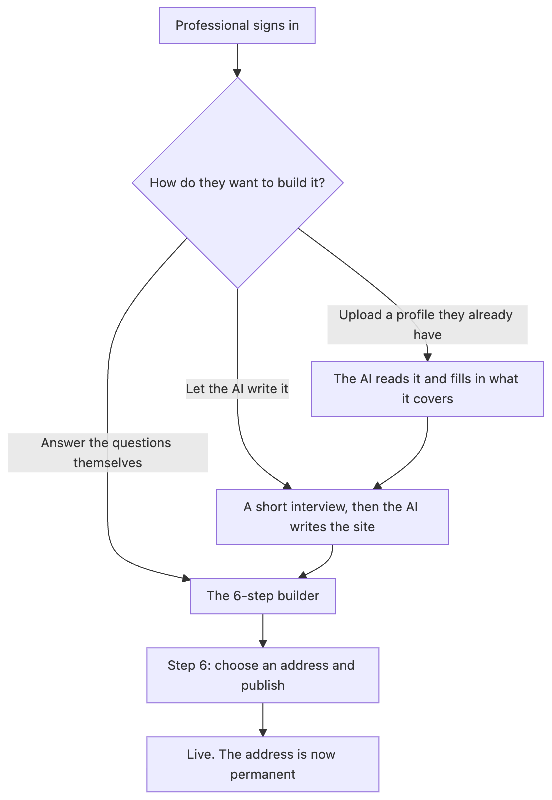

**What happens once it is live**

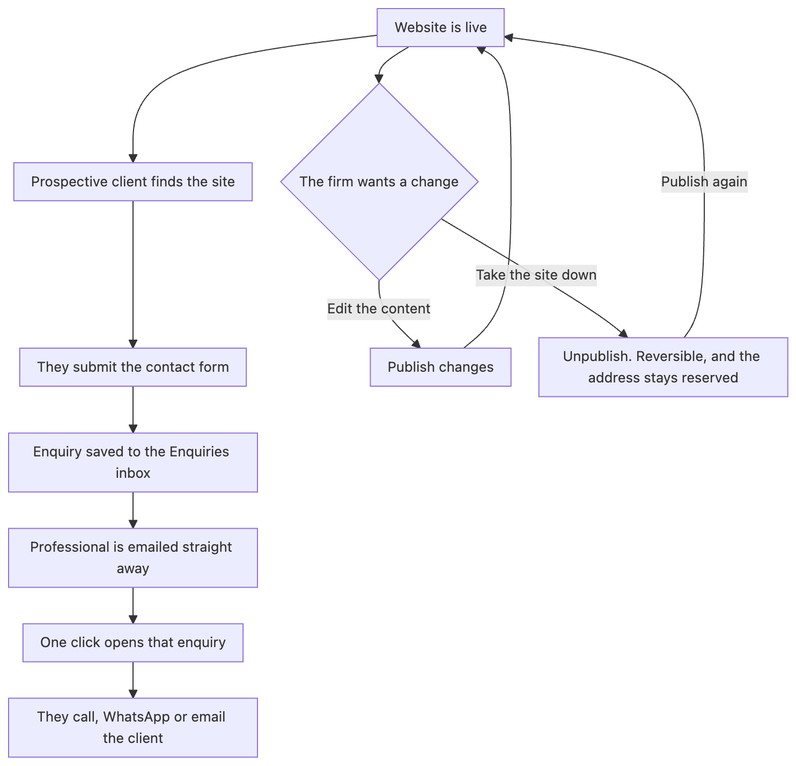

### 5.2 Signing In & Your Account

The builder is protected by a login screen (email and password). Signing in loads the user's saved site straight into the builder, exactly as they last left it, whether it's a draft or already published.

The account card in the bottom-left corner of the builder (name, email, and initials) opens the account menu when clicked:

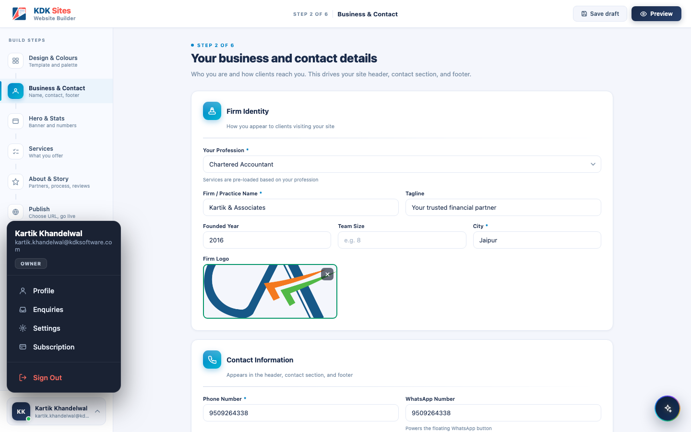

| Menu item | What it does today |
|---|---|
| Profile | Placeholder: not yet built |
| Enquiries | Opens the same Enquiries inbox described in [Section 5.6](#56-managing-enquiries) |
| Settings | Placeholder: not yet built |
| Subscription | Placeholder: not yet built |
| Sign Out | Ends the session and returns to the login screen. Also clears anything saved only on this device (an in-progress draft, AI Writer answers not yet saved to the cloud), so the next person to sign in on this device never sees a previous user's unsaved work. |

Only **Enquiries** and **Sign Out** are functional at the moment. Profile, Settings, and Subscription are reserved slots for later: account details, notification preferences, and whatever future commercial features get decided, respectively.

### 5.3 Two Ways to Build: Do It Yourself, or Let the AI Do It

Every user can either:

- Work through the **6-step wizard** below at their own pace, filling in each screen, **or**
- Open the **AI Website Writer** (a floating button, always available) and answer a short set of questions in plain conversational language. The AI then writes the entire site's content for them, and drops it straight into the same 6 steps.

Both paths lead to the exact same place: a finished configuration ready for Step 6 (Publish). Most users are expected to prefer the AI path; the manual steps stay available for anyone who wants full control, or wants to fine-tune what the AI produced.

There is a **third way in**, which is a third starting point rather than a third product: the user uploads a profile document the firm already has, and the AI Writer opens with its answers already filled in from that document. It feeds the same interview and the same six steps, and is described in [Section 5.5](#55-the-ai-website-writer).

### 5.4 The 6-Step Manual Builder

| Step | Name | What the user does |
|---|---|---|
| 1 | **Design & Colours** | Pick one of 4 website designs, then one of 6 colour palettes for that design |
| 2 | **Business & Contact** | Firm name, profession (which loads the right starter services), phone, email, office address, office hours, social links |
| 3 | **Hero & Stats** | The main banner text visitors see first, plus up to 6 key numbers (e.g. years in practice, clients served) |
| 4 | **Services** | Turn the pre-loaded services for their profession on or off, edit any description, or add their own |
| 5 | **About & Story** | Firm story, founder/partner photos and roles, how the firm works (a numbered process), and client reviews |
| 6 | **Publish** | Pick a web address and go live |

The wizard can be moved through in any order using a left-hand navigator, and it does not force a strict front-to-back path, but every required field is still checked before the site can actually be published. The exact rule for every field is in [Section 6](#6-functional-requirements--validation-rules).

#### Step 1: Design & Colours

Picking a design and a matching colour palette. Nothing here is ever left unset. Every account starts on a default design and palette (see [Section 6.1](#61-manual-builder-step-1-design--colours)), so this step is about changing that default, not filling in a blank.

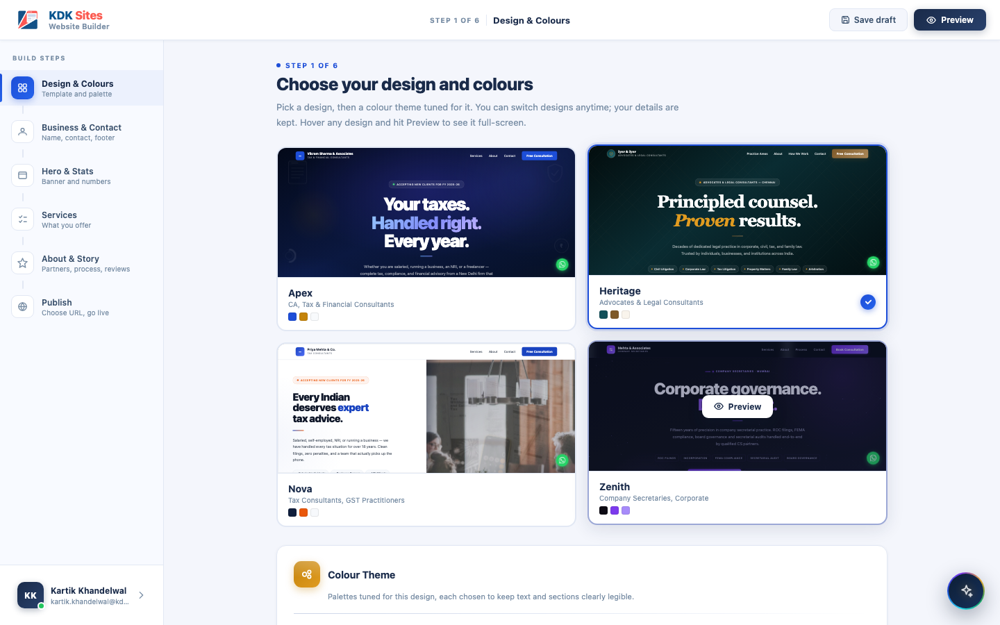

Each design carries its own set of 6 curated colour palettes, so the same layout can look completely different from one firm's site to the next. Switching either the design or the palette is instant and keeps every other answer the user has already given; only the look changes:

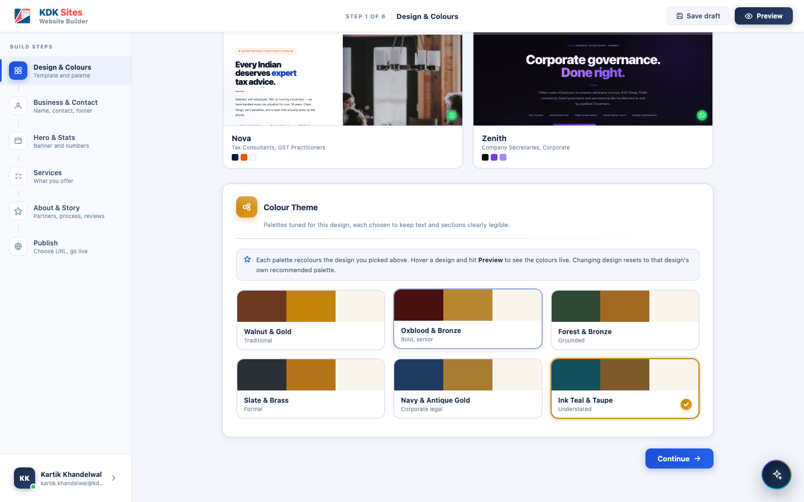

#### Step 2: Business & Contact

The firm's identity and how clients reach them. This step is split into four sections:

- **Firm Identity**: profession, firm/practice name, tagline, founded year, team size, city, and an optional firm logo.
- **Contact Information**: phone number, WhatsApp number, email, office hours, office address, and optional membership/registration numbers (e.g. an ICAI membership number for a CA, or a firm registration number).
- **Social Media Links**: LinkedIn, Facebook, Instagram, YouTube. Each is optional; leaving one blank hides its icon on the published site rather than showing a broken or dead link.
- **Footer**: a short footer blurb and the copyright line shown at the bottom of every page. "Powered by KDK Software" is added automatically and cannot be removed.

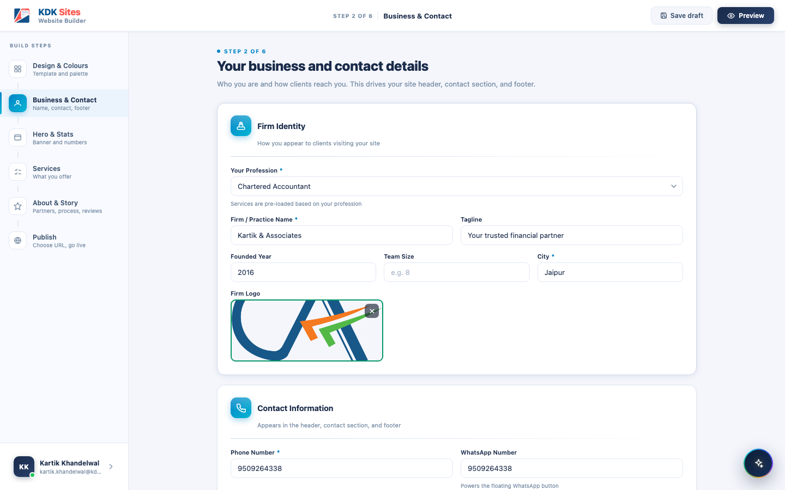
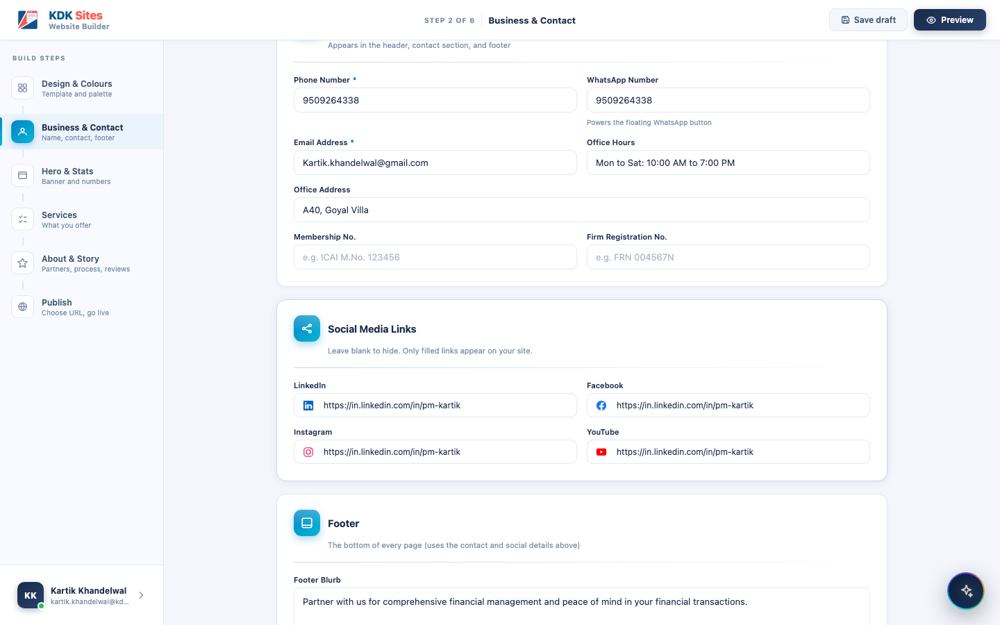
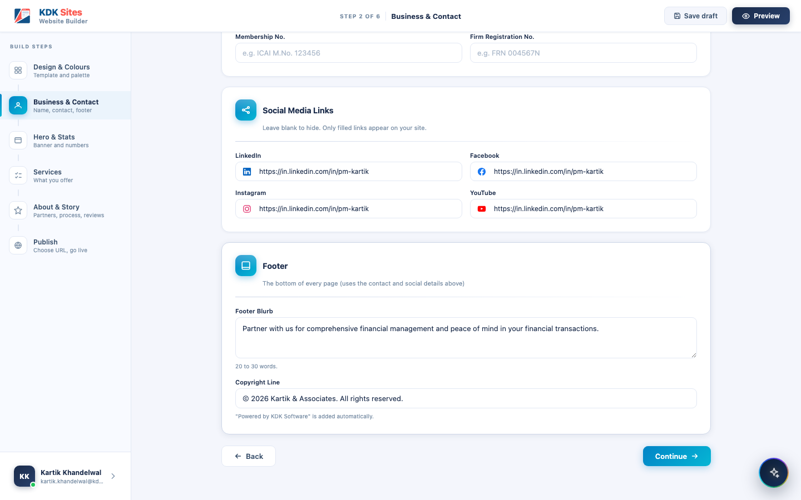

#### Step 3: Hero & Stats

The banner text and key numbers a visitor sees first. This step covers:

- **Hero Banner**: an eyebrow badge (e.g. "Now accepting clients for FY 2025-26"), the headline, a highlighted phrase within it (shown in the site's accent colour), a sub-heading, primary and secondary call-to-action buttons, and audience tags (short labels like "Small Businesses" or "NRI Clients" shown under the hero).
- **Key Stats**: up to 6 numbers that build trust (clients served, years of practice, ratings, on-time percentage, etc.), each with a quick-insert button for common symbols (★, ₹, +, %, ✓). This follows the same "3 to 6, or none at all" reasoning as the AI Writer's equivalent screens ([Section 6.7](#67-ai-website-writer-screen-1-your-practice), [6.8](#68-ai-website-writer-screen-2-what-sets-you-apart)). The manual builder itself does not block a half-filled set, but the same design reasoning applies: a stats strip with one or two numbers looks unfinished.

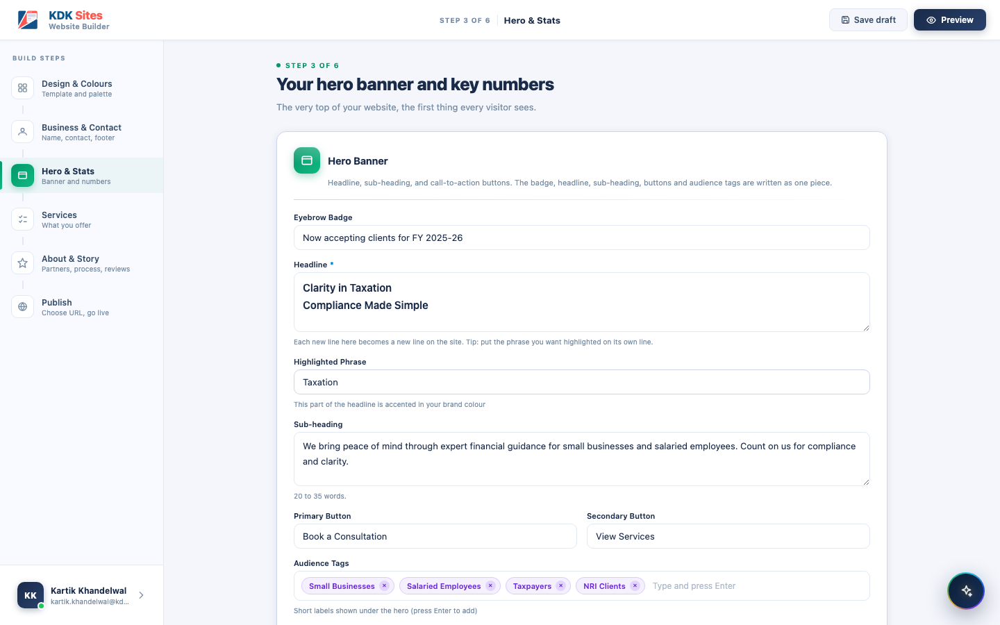
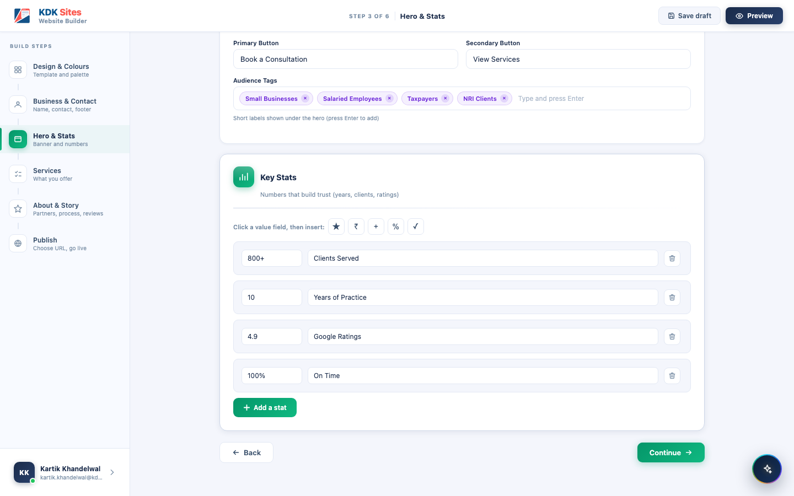

#### Step 4: Services

The profession's starter services, editable and extendable. Every pre-loaded service (see [Section 3.3](#33-who-this-is-for) for the list per profession) can be switched on or off with a toggle, and its name and description can be freely edited. A text box at the bottom lets the user add entirely custom services beyond the starter list, useful for a firm that offers something not in the standard set (e.g. "Virtual CFO Services").

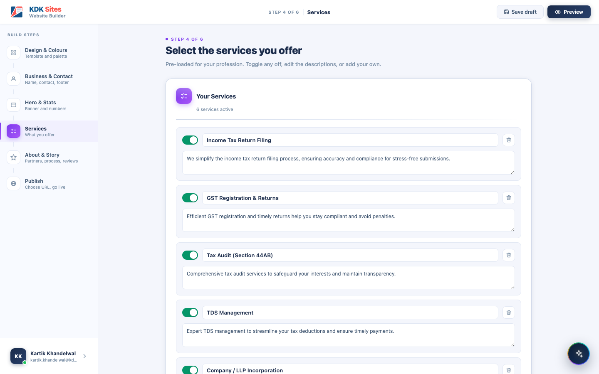
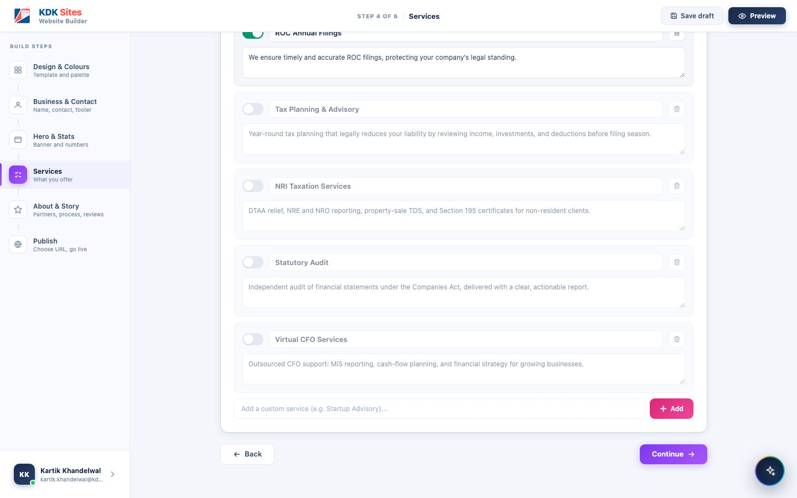

#### Step 5: About & Story

The firm's story, partners, process, and reviews. This is the largest step, split into five sections:

- **About Your Firm**: a short introduction (45 to 70 words) shown in the About section.
- **Founders & Partners**: up to 4 partners, each with a name, role/designation, an optional portrait (auto-cropped to a square), and a short bio with credentials (one per line, rendered as bullet points).
- **About Highlights**: exactly 3 short selling points shown alongside the About section (e.g. "Deep Experience," "Fast GST Services," "Error-Free Filing"), each with a one-line explanation.
- **How We Work**: 3 to 5 numbered steps describing the client journey, shown as a connected row of cards on the published site.
- **Client Testimonials**: optional; if used, 3 to 6 reviews, each with a star rating, quote, client name, role/company, and an optional photo.

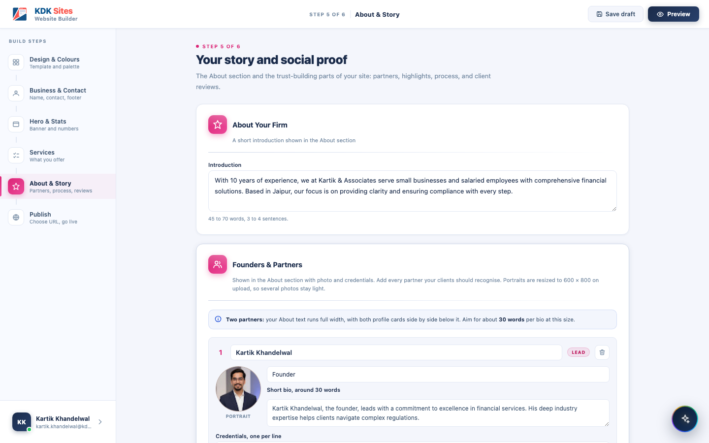
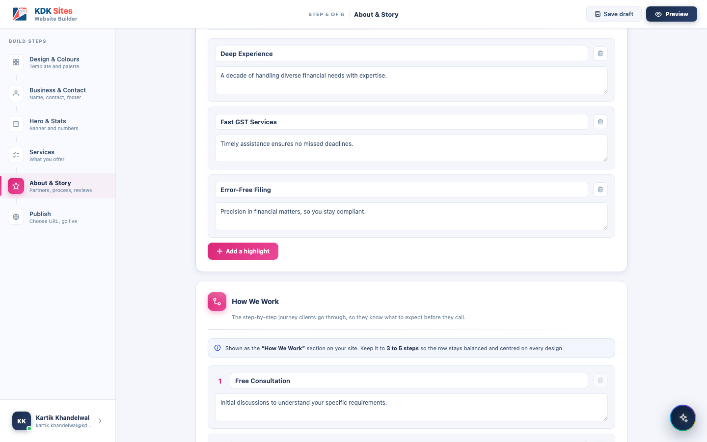
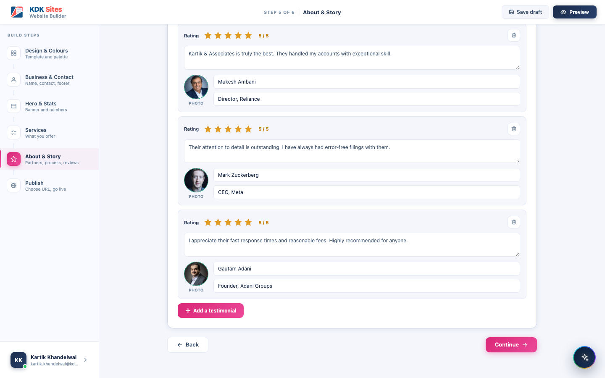

#### Step 6: Publish

The live preview, the web address, and every control for managing a live site. What this screen shows depends entirely on where the site currently stands: there are four distinct states, not one static screen:

**1. Never published yet.** The very first time a user reaches this step, there is no live site to show: only a preview of what will go live, a checklist confirming what is included, and a single **Launch Website** button (shown disabled until the typed address is confirmed available). Once nothing is left to complete, the screen gives its last useful warning: *"Check your address before you launch. It cannot be changed afterwards, so that every link you share keeps working."* Until then that space is used to name whatever is still missing, since two warnings stacked together are both ignored.

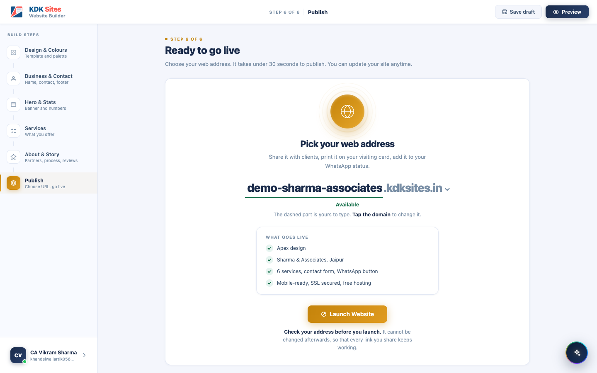

**2. Live, with changes not yet published.** After the first publish, any further edit anywhere in the builder puts the site into this state: the live preview still shows what visitors currently see, but a banner makes clear that newer changes are waiting, naming the date of the version that is actually out there. The buttons are **Publish changes** and **Unpublish**.

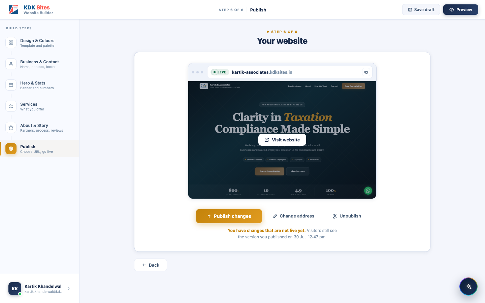

**3. Live, and fully up to date.** Once "Publish changes" is pressed (or nothing has been edited since the last publish), the hint changes to confirm the site matches what's live, and there is nothing to publish: **Unpublish** is the only button left.

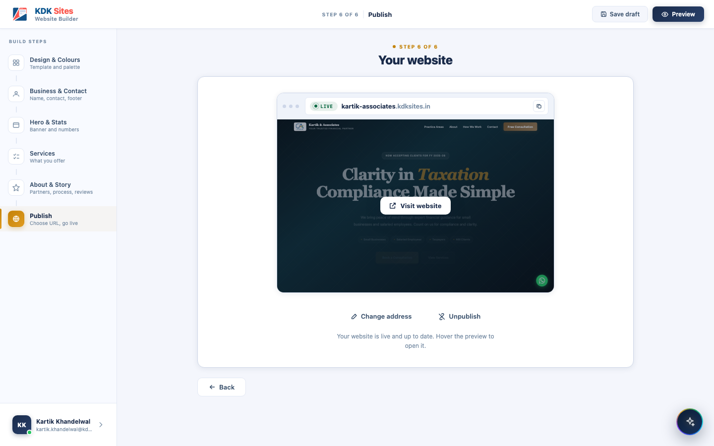

**4. Taken offline (unpublished).** After pressing Unpublish, the preview dims and is stamped "NOT PUBLISHED," the browser-style bar shows an "OFFLINE" badge, and the only action is **Publish again**. The address itself is never released, so nobody else can claim it while the site sits offline: *"Your site is offline. Your address stays reserved for you."*

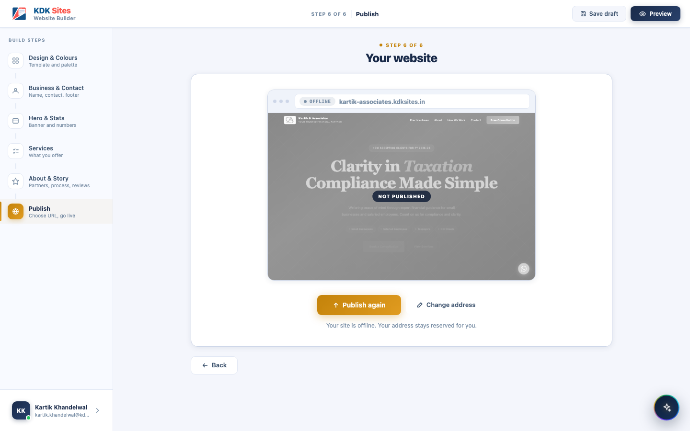

##### The address is permanent once the site is live

**A published site's address cannot be changed.** The address is chosen once, before the site is launched, and the field is read-only from that moment on. There is no way for the professional to rename a live site, and no way to move it to a different domain in the pool.

The reasoning matters more than the rule, because the rule looks restrictive on its own:

- A changed address breaks **every link already shared**: visiting cards, WhatsApp forwards, client emails, the firm's letterhead.
- Google has to find and re-rank the new address from scratch, undoing the site's search standing.
- The old address becomes free for **someone else** to claim, so a competitor could end up sitting on the address a firm printed on its stationery.

**What this means for a mistake.** A professional who launches with a typo in their address has to live with it: there is no correction path for the user, and no admin screen for KDK support either. There is also no Delete anywhere in the product, so a site cannot be removed and re-created at a better address. Unpublish keeps the address reserved and is the only way down. This is why the warning before launch is worded as firmly as it is.

Two more rules worth knowing:

- **The address is a pair** (a subdomain plus a domain; see [Section 7](#7-finalised-domain-names) for the domain pool). Because either half moving counts as a move, the permanence rule covers both: a live site cannot be shifted to a different domain in the pool any more than it can be renamed.
- **Publishing is always gated on every step being complete.** Pressing Launch Website / Publish changes re-checks every required field across Steps 2 to 6 (not just Step 6 itself) and, if anything is missing, jumps the user straight to the first incomplete step rather than failing silently.

#### Open Question: How Many Times Can a Site Be Published?

> **Open question, not yet decided.** There is currently **no limit anywhere in the product** on how many times a professional can publish or re-publish their site. Every "Publish changes" click goes live immediately, with no daily cap, cooldown period, or review step in between. Whether a limit should exist (for abuse prevention, cost control, or as a lever tied to a future paid plan) has **not been decided**. Any future limit would change a promise this document currently makes throughout, that publishing is instant and always available.

### 5.5 The AI Website Writer

This is a short, conversational interview (7 screens plus a final review) that stands in for typing everything out by hand.

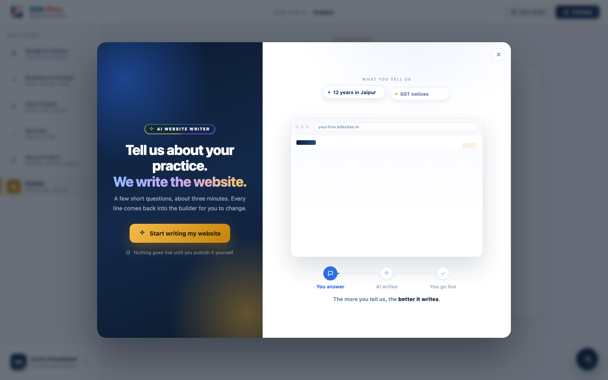

**What it asks, screen by screen:**

1. **Your practice**: profession, firm name, years practising
2. **What sets you apart**: what you're best known for, your typical clients, and (optionally) key numbers to show off
3. **How you work**: a step-by-step description of your process
4. **Founders & partners**: name, role, what each partner handles, and a photo
5. **Client reviews**: optional testimonials
6. **Contact details**: city, phone, email, office address, office hours, social links
7. **Anything else**: a free-text box for anything not already covered (awards, languages, specialisations)
8. **Review & write**: a final summary before the AI generates the site

**What makes it easier for a returning user:** if the firm already has a published site, opening the AI Writer automatically fills in every plain fact it already knows: firm name, city, years in practice, phone, email, address, office hours, social links, and every partner's name, role, and photo (shown highlighted in green below, with a note explaining where each came from). Only the more subjective, judgement-based answers (what you're known for, your typical clients, your review notes) are left blank for the user to (re)describe. This is because the site only stores the AI's polished write-up of those answers, not the user's original rough notes, and feeding the polished text back in as a "question" just produces blander answers on a second pass.

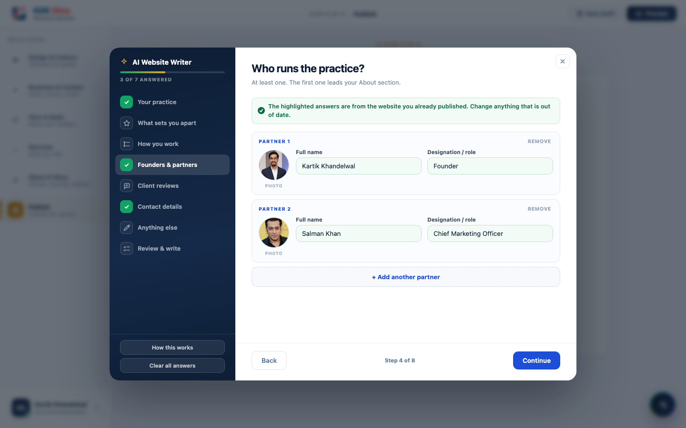

**Why partners are asked what they handle:** a name and a designation alone give the AI nothing to write from, and it fills that gap by inventing plausible-sounding history for a real, named person. The box is optional, but whatever is typed into it is the only material the partner's write-up may be built from. Left empty, the AI writes a short factual line naming the person's role and nothing more.

#### Starting From a Profile the Firm Already Has

Most established firms already have a profile document: a firm brochure, a partner's CV, a capability statement sent to clients. Retyping it into an interview is work the professional has already done once. So the AI Writer opens with a choice:

- **Start writing my website**, which begins the interview empty, exactly as described above, or
- **I already have a firm profile**, which lets the user upload it.

**Both choices carry equal visual weight.** Plenty of sole practitioners have no such document, and that path must never read as the lesser one.

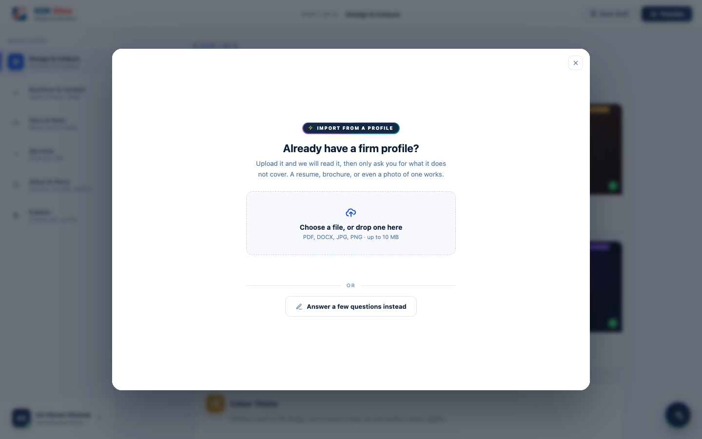

Once the document has been read, the interview opens with those answers already in place. The rail on the left shows which screens the document completed; the rest are still to be answered, and their fields are left empty rather than guessed.

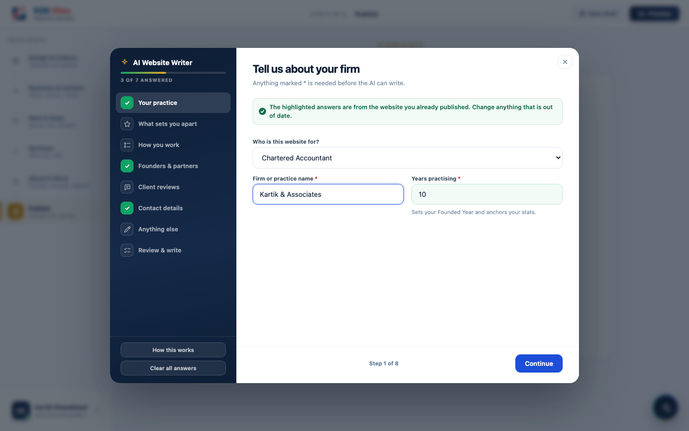

Uploading is a **starting point, not a shortcut, and the product must not imply otherwise.** The document pre-fills the interview; it does not replace it. Whatever the document did not cover is still asked for, screen by screen, before the site can be written. For the same reason, **Import from a profile** also sits permanently in the left-hand drawer, so someone who skipped it at the start, or who found their document later, can bring it in without discarding the answers they have already given. An import made part-way through fills empty boxes only and never overwrites anything the user has typed.

Accepted formats are **PDF, Word documents, and photographs** of a printed profile, up to 10 MB. A photograph is deliberately included: for many firms the only copy that exists is a printed one.

**What the user sees afterwards:** the interview opens with its answers already in place, every imported answer **tinted green**, under a banner naming the uploaded document as the source. This is the same visual treatment already used for answers carried over from a published site, so the user learns one convention rather than two, and can see at a glance exactly which answers came from a machine and need checking.

##### The rule this feature is built around

> **A field the document does not state comes back empty. It is never guessed.**

This is [Section 6.15](#615-the-rule-behind-all-of-this-no-placeholder-content-on-a-live-site) applied one step earlier, and it is a hard rule rather than a quality preference. If the AI invents a plausible "best known for" or an impressive client count, the professional publishes a claim they never made and were never asked about. These users are ICAI and Bar Council registered and work under advertising and misrepresentation rules, so a fabricated credential on their website is their liability, written by our product.

An empty field is therefore a correct outcome, not a shortfall: the interview treats it as unanswered and asks the user for it.

A worked example, because this behaviour reads as a bug until it is explained. One firm's profile states *"more than 50 years in aggregate experience"*, meaning the total across its six partners. The correct result is to leave "Years practising" **empty** and keep the 50 only as a key number with its qualifier intact. Filling in 50 would publish "50 years of practice" for a firm that may be ten years old.

##### What the document fills, and what the interview still asks

| Taken from the document | Never taken from the document |
|---|---|
| Firm name, city, phone, email, office address, office hours | Client reviews, so that skipping that screen leaves testimonials already live untouched |
| Years practising, but only where stated or derivable from a founding year | Any figure for the stats strip that is not a genuine client-facing trust signal |
| Partner names, and a partner's designation only where the document states a job title | A partner's role inferred from a qualification |
| Which of the builder's own services to switch on, matched on meaning rather than wording | New services outside the builder's preset list |
| Social links, and claims the document explicitly makes about the firm | Anything the document merely implies |

**Key numbers deserve their own note**, because an almost-empty result here looks like a failure and is not. A good website statistic is a trust signal aimed at a prospective client: "2,000+ clients", "4.9 star rating", "46 years in practice". A firm profile is an internal document, and its numbers are a different kind entirely: team size, partner count, staffing breakdown. Those are true and irrelevant, and putting them on the most prominent strip of the homepage produces lines like "13 team members" or "8 audit staffs", which make a practice look small. Across three real firm profiles, applying the correct bar yields one usable figure in total. This field belongs to the user, and the interview already asks for it in the right terms.

##### Privacy

**The uploaded document is not kept.** It is read once, and discarded. It is not saved to the professional's account, not stored on KDK's servers, and not retained in any form afterwards. Only the extracted answers reach the user's own draft, and only after they have seen them on screen. Customers will ask this, and the answer must stay this simple.

##### Cost to KDK

Reading a profile costs about **₹0.35 per website**, once, measured across real firm profiles of 9 to 15 pages. It does not scale with file size, and it is not a per-visitor or recurring cost. Allowing for a user who imports, corrects, and regenerates, budget ₹1 to ₹2 per website.

### 5.6 Managing Enquiries

Every website has a contact form. When a visitor submits it, the enquiry is saved instantly into a built-in **Enquiries inbox** inside the builder. The professional does not need any other tool to see it.

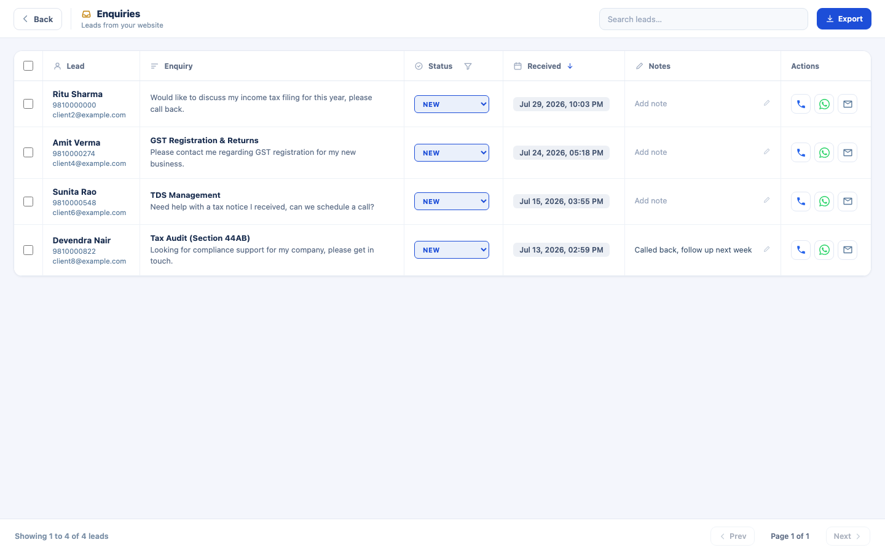

> The names, numbers, and messages shown above are illustrative examples, not real visitor data, swapped in only for this document.

From that inbox the professional can:

- Search and filter enquiries by status (new, in progress, done, etc.)
- Add private notes to any enquiry
- Call, WhatsApp, or email the visitor directly from the same screen
- Export enquiries to Excel, either individually selected or all at once

#### Being Told an Enquiry Has Arrived

An inbox nobody is told about is a missed client. A professional who opens the builder once a week leaves an enquiry sitting for a week, which is exactly the outcome this product exists to prevent, so **every enquiry is emailed to the professional the moment it is submitted, and one click in that email opens that enquiry.**

**The enquiry is saved first, and the email is sent afterwards.** An email that fails, for any reason, must never be able to cost the professional the enquiry itself: the record is already safe in the inbox before any mail is attempted. Equally, the alert has to actually reach the inbox rather than a spam folder, which means it is sent from a properly configured KDK address through the transactional email service KDK already uses (ZeptoMail), not from the professional's own address.

##### Who receives it

##### What the email says

**Subject:** New enquiry from *[visitor's name]* for *[firm name]*

**Preview line**, so the essentials are readable on a phone without opening the mail: *phone number · what they are interested in · when it arrived*

```
  [ KDK Sites logo ]

  You have a new enquiry

  Someone filled in the contact form on your website
  [ the firm's web address ].

  Name           [ visitor's name ]
  Phone          [ visitor's phone ]        tap to call
  Email          [ visitor's email ]        row hidden if not given
  Interested in  [ service selected ]       row hidden if not given
  Received       [ date and time, IST ]

  Their message
  [ the message ]                           block hidden if not given

       [  View this enquiry  ]

       [ Call ]     [ WhatsApp ]

  You are receiving this because this enquiry came through your
  website on KDK Sites.
```

Both the firm name and the web address appear because one account may own more than one site, and the owner has to be able to tell at a glance which of them the enquiry came from.

Three rules the email must follow:

1. **A blank field prints nothing at all.** Only a name and a phone number are compulsory on the contact form, so the email address, the chosen service, and the message may each be missing. Any missing row disappears from the email entirely. It is never filled with a placeholder or an example, which is [Section 6.15](#615-the-rule-behind-all-of-this-no-placeholder-content-on-a-live-site) applied to the alert.
2. **Replying reaches the client.** When the visitor gave an email address, pressing Reply must write to them, not to an unattended KDK mailbox. When they did not, the email simply carries no reply address.
3. **It must read correctly as plain text as well as with formatting.** Many corporate mail systems strip or distrust formatted mail, and this message has to survive that.

Language is English to begin with; whether a Hindi version is offered is an open question below.

##### The click through

**"View this enquiry" opens that specific enquiry, not merely the inbox.** In practice that means the enquiry is found and shown wherever it sits in the list, however old it is, marked clearly on arrival and with its full message already open, so the professional reads it without searching. If they are not signed in, signing in must take them to that same enquiry rather than dropping them at the front of the builder: this click will often be their first visit of the day.

##### Junk enquiries have to be handled alongside this

The contact form on a published site currently accepts anything submitted to it. Today that means the occasional junk entry in an inbox the professional opens when they choose. **The moment alerts are switched on, the same automated junk goes straight to their mailbox**, and the resulting spam complaints damage the reputation of the single KDK address that every client's alerts are sent from, harming every client at once.

**Basic protection is therefore part of this requirement, not a follow-up to it:** a hidden field that only automated submissions fill in, and a ceiling on how many alerts one site may send in an hour, with a single summary email once that ceiling is reached.

## 6. Functional Requirements & Validation Rules

This section lists exactly what is required on every screen, and the rule the product enforces for each field. Anything not listed as required is optional. Each rule is written so both a non-technical reader and a developer can follow it.

### 6.1 Manual Builder, Step 1: Design & Colours

| Field | Required? | Validation rule |
|---|---|---|
| Website design | Always set | There is no "unselected" state: every account starts on a default design (Apex) with its first colour palette already applied, so nothing blocks progress here. The user can switch to any of the other 3 designs at any time, and switching keeps all of their content; only the look changes. |
| Colour theme | Always set | Same as above: a palette from the chosen design's set of 6 is always active by default. Picking a different one is optional and instant. There is nothing to "submit"; the live preview updates immediately. |

### 6.2 Manual Builder, Step 2: Business & Contact

| Field | Required? | Validation rule |
|---|---|---|
| Profession | Yes | Must be selected from the list of 6 supported professions |
| Firm / practice name | Yes | Cannot be left blank |
| City | Yes | Cannot be left blank |
| Phone number | Yes | Cannot be left blank |
| Email address | Yes | Cannot be blank, and must be in a valid email format (some text, an @ symbol, more text, a dot, more text, e.g. `you@yourfirm.in`) |
| Firm logo / any photo upload | No | If a file is chosen, it must be an image (PNG, JPG, SVG, WebP, or GIF) and no larger than 2 MB for a logo, or 5 MB for any other photo. A file outside these limits is rejected with a clear message rather than silently failing. |

### 6.3 Manual Builder, Step 3: Hero & Stats

| Field | Required? | Validation rule |
|---|---|---|
| Hero headline | Yes | Cannot be left blank |
| Key numbers (stats) | No | Optional. If none are added, the section is left out entirely |

### 6.4 Manual Builder, Step 4: Services

| Field | Required? | Validation rule |
|---|---|---|
| Services shown on the site | At least 1 | At least one service must be switched on before the user can continue |

### 6.5 Manual Builder, Step 5: About & Story

| Field | Required? | Validation rule |
|---|---|---|
| Founders / partners | At least 1 | At least one partner must have a name entered |
| Partner / reviewer photo | No | Same image-file rule as above: accepted formats only, 5 MB ceiling. Every accepted photo is automatically cropped to a square before it's stored, since every design displays it that way. |
| Firm story, process steps, client reviews | No | All optional. Any section left empty is hidden from the published site rather than showing placeholder content |

### 6.6 Manual Builder, Step 6: Publish

| Field | Required? | Validation rule |
|---|---|---|
| Web address (subdomain) | Yes | Cannot be blank. Must be at least 3 characters, and may only contain lowercase letters, numbers, and hyphens (no spaces or other symbols). Must also pass a live availability check confirming nobody else already holds that address. |
| Changing the address after launch | Not permitted | Once the site has been published even once, the address (both the name and the domain it sits on) is fixed and the field is read-only. There is no way for the professional to change it, and no admin override. The user is warned of this on screen before they launch, which is the last moment the warning is any use. |
| Deleting a site | Not offered | There is no delete anywhere in the product. Unpublish is the only way down: it is reversible, it keeps the address reserved to that account, and it keeps every enquiry ever captured. |

### 6.7 AI Website Writer, Screen 1: Your Practice

| Field | Required? | Validation rule |
|---|---|---|
| Profession | Yes | Must be selected |
| Firm / practice name | Yes | Cannot be left blank |
| Years practising | Yes | Cannot be left blank. This is the one number the AI can always rely on: it sets the firm's "Founded Year" and anchors any stats the AI writes if no key numbers were supplied. |

### 6.8 AI Website Writer, Screen 2: What Sets You Apart

| Field | Required? | Validation rule |
|---|---|---|
| What you're best known for | Yes | At least 2 entries required |
| Your typical clients | Yes | At least 2 entries required |
| Key numbers worth showing | No | Optional, but if any are added, at least 3 must be added (up to a maximum of 6). A half-filled set (1 or 2 entries) is not allowed, because the stats strip on the published site is designed to hold several numbers, and a couple of entries would look incomplete. The AI never invents a number the user did not provide. |

### 6.9 AI Website Writer, Screen 3: How You Work

| Field | Required? | Validation rule |
|---|---|---|
| Process steps | Yes | At least 3 steps required (maximum 5). The "How We Work" section is a row of connected cards, and fewer than 3 reads as unfinished. |

### 6.10 AI Website Writer, Screen 4: Founders & Partners

| Field | Required? | Validation rule |
|---|---|---|
| At least one partner | Yes | At least 1 partner row required (maximum 4) |
| Each partner's name | Yes, per row started | Any partner row that has been started must have both a name and a role before the interview can continue |
| Each partner's role/designation | Yes, per row started | Same as above: required alongside the name, because the AI uses the role to make each partner's write-up distinct rather than four near-identical paragraphs |
| What do they handle? | No | A free-text line describing that partner's area (for example, "leads the firm's valuation and M&A work"). It is the only source the AI is allowed to build a partner's write-up from: given nothing but a name and a designation, the writer was inventing career history for a real, named person, which for an ICAI or Bar-regulated professional is their liability, not ours. |
| Partner photo | No | Optional. Cropped to a square on upload, because every design displays it that way. |

### 6.11 AI Website Writer, Screen 5: Client Reviews

| Field | Required? | Validation rule |
|---|---|---|
| Reviews | No | Entirely optional. The whole section can be skipped. But if the user adds any review, at least 3 are required (maximum 6). Skipping this screen keeps whatever reviews already exist on a previously published site untouched. |
| Each review's client name | Yes, per row started | Any review row that has been started must have both a name and a note before the interview can continue |
| Each review's note | Yes, per row started | Same as above: required alongside the name, since the note is what the AI turns into the polished review; a name with no note would force the AI to invent the review's content |

### 6.12 AI Website Writer, Screen 6: Contact Details

| Field | Required? | Validation rule |
|---|---|---|
| City | Yes | Cannot be left blank |
| Phone number | Yes | Cannot be left blank |
| Email address | Yes | Cannot be blank, and must be in valid email format |
| Office address | Yes | Cannot be left blank. This field cannot be invented by the AI, and every template shows a real address or none, never a sample one. |
| Office hours | Yes | Cannot be left blank. Pre-filled with a common default (`Mon to Sat: 10:00 AM to 7:00 PM`) that the user can edit or keep. |
| Social media links | No | Optional. Each one supplied becomes an icon in the site's footer. |

### 6.13 Import From a Profile Document

| Field | Required? | Validation rule |
|---|---|---|
| The uploaded file | No | Import is always optional; every answer it fills can be given by hand instead. A file must be a PDF, a Word document, or an image (including a photograph of a printed profile), and no larger than 10 MB. Anything else is refused with a clear message naming what is accepted. |
| Number of files | One per import | A single document is read at a time. Importing again later is allowed, and follows the same fill-blanks-only rule below. |
| Every answer the document fills | Must be shown as imported | Each filled answer is tinted green, under a banner naming the uploaded document as its source, so the user can see exactly what to check before it becomes their website. |
| Every answer the document does not state | Must be left empty | No inference, no estimate, no reasonable guess: a job title is never turned into an expertise claim, a past employer is never turned into a client, and an aggregate figure across partners is never turned into the firm's own age. The empty answer then becomes a question the interview asks, under the normal rules in 6.7 to 6.12. |
| Importing part-way through the interview | Fills blanks only | An import can never overwrite an answer the user has typed. Where a document and a published site both offer a value for the same empty field, the document wins, because uploading it was a deliberate act. |
| Services | Chosen from the preset list only | The import switches on the services the document supports, matched on meaning rather than exact wording. It cannot create a service that is not in the profession's preset list. |
| The uploaded file afterwards | Must not be retained | The document is read once and discarded: not stored against the account, not kept on KDK's servers, not retained in any form. |

### 6.14 Email Alert When an Enquiry Arrives

| Requirement | Rule |
|---|---|
| When it is sent | On every enquiry, as soon as it is submitted. |
| Order of events | The enquiry is stored first, and the email sent afterwards. A failure to send must never cost the professional the enquiry. |
| Who it goes to | The address on record for the site's owner (see the open question in [Section 5.6](#56-managing-enquiries)). |
| What it contains | Visitor's name, phone, email, chosen service, message, when it arrived, and which of the owner's sites it came from, laid out as shown in Section 5.6. |
| Missing details | Only a name and a phone number are compulsory on the contact form. Any field the visitor left blank is removed from the email entirely, never replaced by a placeholder or an example. |
| Replying | When the visitor gave an email address, a reply goes to the visitor. When they did not, the email carries no reply address. |
| The link | Opens that one enquiry, wherever it sits in the list, marked and with its message already expanded. Signing in on the way must not lose it. |
| Automated junk | The contact form must reject automated submissions silently, and no site may send more than a set number of alerts in an hour; beyond that ceiling a single summary email is sent instead. |
| Delivery | Sent from a KDK address configured so that these emails reach the inbox rather than the spam folder. |

### 6.15 The Rule Behind All of This: No Placeholder Content on a Live Site

Across every screen above, the product follows one consistent principle: **if a field is genuinely optional and the user leaves it empty, that section of the website disappears. It never falls back to showing the template's own sample text.** For example, a firm that adds no client reviews gets no testimonials section at all, rather than the design's built-in sample quotes. A firm that provides no key numbers gets no stats strip, rather than an invented one. This is treated as a hard product rule, not a preference: any new field added to the builder in future must have a clear, deliberate answer to "what does the published site show if this is left blank?"

The same rule governs two surfaces beyond the website itself, and for the same reason:

- **What an import may fill in** ([Section 6.13](#613-import-from-a-profile-document)). A fact the uploaded document does not state is left empty and asked for, never estimated. An invented claim published under a professional's own name is their liability, and we would have written it.
- **What an alert email prints** ([Section 6.14](#614-email-alert-when-an-enquiry-arrives)). A detail the visitor did not give is left out of the email entirely, rather than shown as an example address or a sample message.

## 7. Finalised Domain Names

Every published site needs a web address in the form `<firm-name>.<domain>`. KDK is building a small pool of its own domain names so a professional can pick the one that best suits their profession, rather than every site sharing a single generic address.

| Domain | Positioning | Status |
|---|---|---|
| `kdksites.in` | The general, all-profession KDK Sites address | **Live**: this is what every site currently publishes to |
| `CAworld.in` | Chartered Accountants | Name finalised, not yet purchased |
| `Mycafirm.in` | Chartered accountancy firms | Name finalised, not yet purchased |
| `caone.ai` | Modern, tech-forward practices | Name finalised, not yet purchased |
| `cadesk.app` | A clean, app-style address | Name finalised, not yet purchased |

Once a domain in this list is purchased and connected, it becomes selectable from the same address picker shown in Step 6 (Publish) above. No other change is needed anywhere else in the product.

## 8. Website Templates & Design System

### 8.1 The Four Designs

| Design | Best for |
|---|---|
| **Apex** | Chartered Accountants, Tax & Financial Consultants (marked "Most Popular") |
| **Heritage** | Advocates & Legal Consultants |
| **Nova** | Tax Consultants, GST Practitioners |
| **Zenith** | Company Secretaries, Corporate professionals |

Each design offers **6 curated colour palettes** of its own (24 combinations in total), each checked to make sure colours are genuinely distinguishable from one another and that text stays easily readable against its background.

Below is each design as a visitor actually sees it, shown here with each template's own placeholder content (a real, published site shows the professional's own name, photos, and text in exactly this layout):

**Apex**
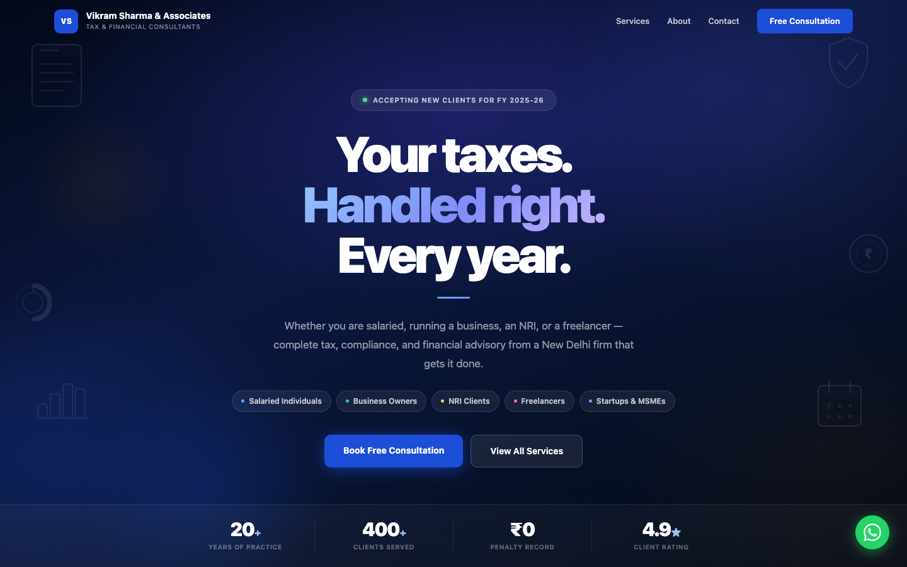

**Heritage**
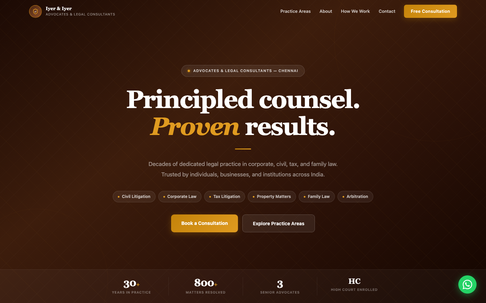

**Nova**
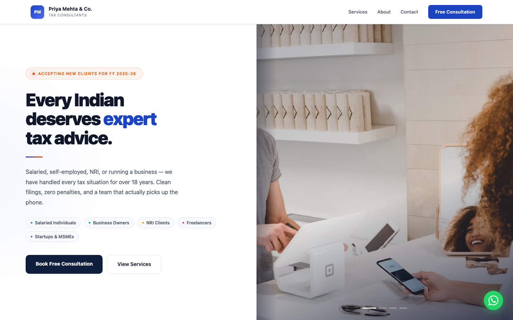

**Zenith**
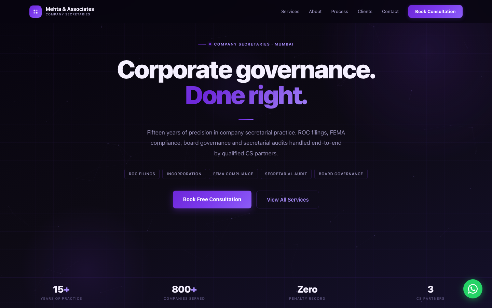

### 8.2 What Every Published Site Includes

Regardless of which design is chosen, every published site has the same set of sections, populated with that firm's own content:

1. **Navigation bar**: firm name/logo and menu, becomes solid on scroll
2. **Hero banner**: firm name, tagline, and calls to action
3. **Key numbers**: up to 6 stats, if the user chose to add them
4. **Services**: the profession's services, as toggled/edited by the user
5. **About**: firm story and credentials
6. **Founders/Partners**: photo, name, and role for each
7. **How We Work**: a numbered process, at least 3 steps
8. **Client Reviews**: testimonials, if the user chose to add them
9. **Contact**: details, an enquiry form, and a floating WhatsApp button
10. **Footer**: firm details and "Powered by KDK Software"

### 8.3 Design Principles

- No emoji anywhere: icons are hand-drawn, geometric line icons
- No Google Fonts or other external assets: uses the device's own system font, so pages load instantly with nothing to download
- Every design is fully responsive on mobile, where the large majority of a professional's clients will view it
- Every published site is automatically secured (https/SSL): visitors never see a "not secure" warning

## 9. Non-Functional Requirements

Written for anyone checking "does this actually meet the bar," not just developers:

| Requirement | What it means in practice |
|---|---|
| **Speed** | Pages should feel instant. No large downloads, no waiting on external fonts or scripts. |
| **Mobile-first** | Every screen, in the builder and on published sites, must work cleanly on a phone, not just a desktop. |
| **Security** | Every published site is served over https automatically. The AI's underlying key/credentials are never exposed to a visitor's browser. All AI requests go through KDK's own server-side service. |
| **Accounts stay private** | A professional's draft and published site are tied to their login; nobody else can see or edit them. |
| **Reversibility** | Taking a site offline always asks for confirmation first, and is always recoverable. There is currently no way to permanently delete a site at all; Unpublish (reversible) is the only way down, and it keeps both the address and every captured enquiry. |
| **A live address never moves** | Once published, a site's web address is permanent, so every link a professional has already shared keeps working and cannot be re-pointed, by them or by anyone else ([Step 6](#step-6-publish)). The trade-off is deliberate: correcting a typed mistake after launch is currently impossible, which is an accepted, recorded open question rather than an oversight. |
| **No broken defaults** | A skipped field must never show someone else's placeholder text on a real, live website (see [Section 6.15](#615-the-rule-behind-all-of-this-no-placeholder-content-on-a-live-site)). |
| **Availability** | Once published, a site should stay reachable continuously; taking it down is something only its owner does deliberately. |
| **Uploaded documents are not kept** | A profile document uploaded for import is read once and discarded. It is never stored against the account, never kept on KDK's servers, and never retained afterwards. Only the answers the professional then reviews on screen are saved. |
| **Enquiries survive everything** | An enquiry is stored the moment it is submitted, before any notification is attempted, so no failure elsewhere can lose one. Enquiries are kept when a site is taken offline, and there is no action in the product that discards them. |
| **Alerts must actually arrive** | Enquiry alerts are transactional email and have to reach the inbox rather than the spam folder, which is why they are sent from a properly configured KDK address and why automated junk is filtered before it can trigger them. |

## 10. SEO: Getting Published Sites Found on Google

Every published site automatically gets the technical groundwork search engines look for: an accurate page title and description drawn from the firm's real details (not template placeholder text), a clean preview image and link summary for when the site is shared on WhatsApp, and a structured, machine-readable summary of the business (name, phone, address, hours, services) that can help a Google search result show more than just a plain blue link. None of this requires the professional to do anything extra: it's generated automatically from whatever they typed into the builder, and updates itself the next time they publish a change.

Two things are known, current limitations rather than something to quickly fix:

- A KDK-provided address (`name.kdksites.in`) will generally rank a little behind a firm's own domain name. This is true of every website builder, not unique to this product, and is part of why a wider pool of finalised KDK-owned domains (see [Section 7](#7-finalised-domain-names)) is being built out.
- Since every site uses one of only four templates, at large scale (thousands of live sites) Google can recognise the shared structure across firms, which may affect ranking. This is a byproduct of how any template-based builder works, and isn't fixable with a small code change.
